# WireGuard 快速组网工具设计文档

## 一、项目概述

### 1.1 项目目标

构建一个基于 WireGuard 技术的快速组网工具，简化 VPN 网络的部署和管理流程。该工具采用星型拓扑结构，所有客户端节点通过公网 VPS 上的服务端进行中转通信。

### 1.2 核心价值

- 降低 WireGuard 组网的技术门槛
- 实现客户端一键接入网络
- 提供集中化的节点管理能力
- 自动化配置生成和密钥管理

### 1.3 功能范围

#### 包含功能
- 服务端管理程序（Python 实现）
- 客户端配置自动生成
- 密钥对自动生成和分发
- 节点信息查询和管理
- 客户端一键接入脚本
- 配置文件和脚本的 HTTP 下载接口
- 配置文件和脚本的本地文件导出

#### 明确不包含
- Web 管理界面
- 用户身份验证机制
- 访问控制列表（ACL）
- NAT 穿透功能
- Relay 中继功能
- 复杂的数据库系统（仅使用 SQLite）

### 1.4 支持平台

- 服务端：Linux（公网 VPS）
- 客户端：Linux、Windows

## 二、系统架构

### 2.1 整体架构

系统采用经典的客户端-服务端（C/S）架构，服务端作为 WireGuard 网络的中心节点，负责配置管理、密钥分发和流量中转。

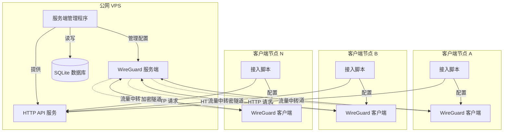

### 2.2 网络拓扑

采用星型拓扑结构，所有客户端节点不直接互联，所有流量必须经过服务端中转。

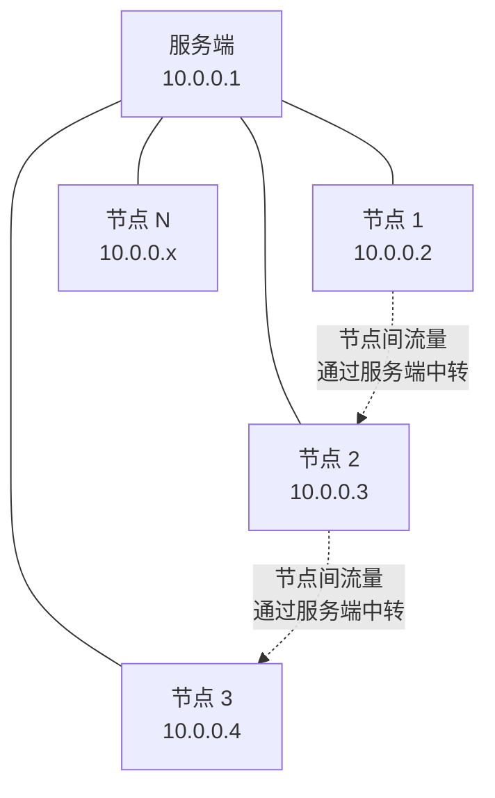

### 2.3 组件职责

| 组件 | 职责 | 技术选型 |
|------|------|----------|
| 服务端管理程序 | 节点注册、配置生成、密钥管理、节点查询 | Python 3.x |
| WireGuard 服务端 | VPN 隧道建立、流量转发 | WireGuard |
| 数据存储 | 持久化节点信息、配置参数 | SQLite |
| HTTP API 服务 | 提供配置下载、节点注册接口 | Python HTTP 服务器 |
| 客户端接入脚本 | 自动化客户端配置和启动 | Shell（Linux）、PowerShell/Batch（Windows） |

## 三、核心功能设计

### 3.1 服务端管理功能

#### 3.1.1 初始化服务端

**功能描述**：在公网 VPS 上初始化 WireGuard 服务端环境。

**执行流程**：
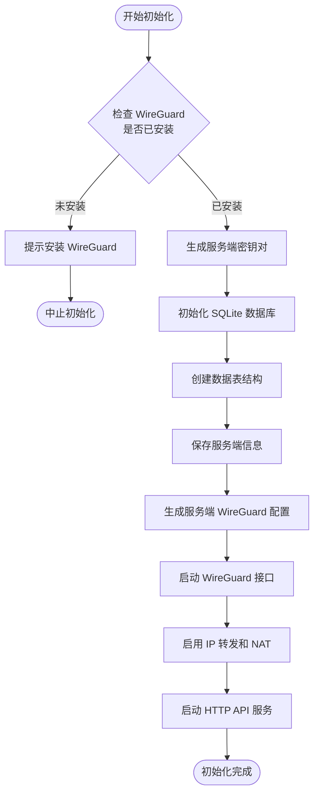

**关键参数配置**：

| 参数名称 | 说明 | 默认值 | 是否可配置 |
|---------|------|--------|-----------|
| 服务端监听端口 | WireGuard 服务端 UDP 端口 | 51820 | 是 |
| 虚拟网络段 | 内网 IP 地址范围 | 10.0.0.0/24 | 是 |
| 服务端虚拟 IP | 服务端在虚拟网络中的 IP | 10.0.0.1 | 是 |
| API 服务端口 | HTTP API 监听端口 | 8080 | 是 |
| 数据库文件路径 | SQLite 数据库存储位置 | ./wg_nodes.db | 是 |

#### 3.1.2 节点注册

**功能描述**：为新客户端分配 IP 地址、生成密钥对和配置文件。

**执行流程**：
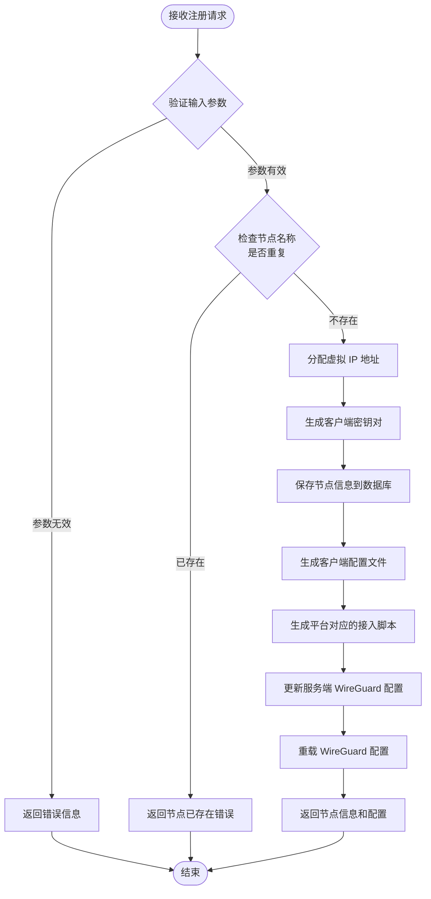

**IP 地址分配策略**：
- 服务端占用网段第一个地址（10.0.0.1）
- 客户端从第二个地址开始顺序分配（10.0.0.2, 10.0.0.3, ...）
- 查询数据库中已分配的最大 IP，新节点分配下一个可用 IP
- 节点删除后 IP 不立即回收，避免地址冲突
- 未来扩展：支持客户端指定偏好 IP（需验证未被占用）

**节点注册输入参数**：

| 参数名称 | 类型 | 必填 | 说明 |
|---------|------|------|------|
| node_name | 字符串 | 是 | 节点名称（唯一标识） |
| platform | 枚举 | 是 | 平台类型：linux / windows |
| description | 字符串 | 否 | 节点描述信息 |

**节点注册输出信息**：

| 字段名称 | 类型 | 说明 |
|---------|------|------|
| node_id | 整数 | 节点唯一 ID |
| node_name | 字符串 | 节点名称 |
| virtual_ip | 字符串 | 分配的虚拟 IP |
| public_key | 字符串 | 客户端公钥 |
| config_content | 字符串 | WireGuard 配置文件内容 |
| script_content | 字符串 | 接入脚本内容 |
| created_at | 时间戳 | 创建时间 |

#### 3.1.3 节点查询

**功能描述**：查看当前已注册的所有节点信息。

**查询维度**：
- 列出所有节点
- 按节点名称查询
- 按节点 ID 查询
- 查询节点详细信息（包括配置和密钥）

**节点信息展示字段**：

| 字段名称 | 说明 | 是否敏感 |
|---------|------|---------|
| 节点 ID | 数据库自增 ID | 否 |
| 节点名称 | 用户定义的名称 | 否 |
| 虚拟 IP | 分配的内网 IP | 否 |
| 平台类型 | linux / windows | 否 |
| 公钥 | 客户端公钥 | 否 |
| 私钥 | 客户端私钥 | 是（仅详细查询时显示） |
| 描述信息 | 节点描述 | 否 |
| 注册时间 | 创建时间戳 | 否 |
| 最后握手时间 | WireGuard 最后通信时间 | 否（需从 WireGuard 获取） |

#### 3.1.4 节点删除

**功能描述**：从系统中移除指定节点。

**执行流程**：
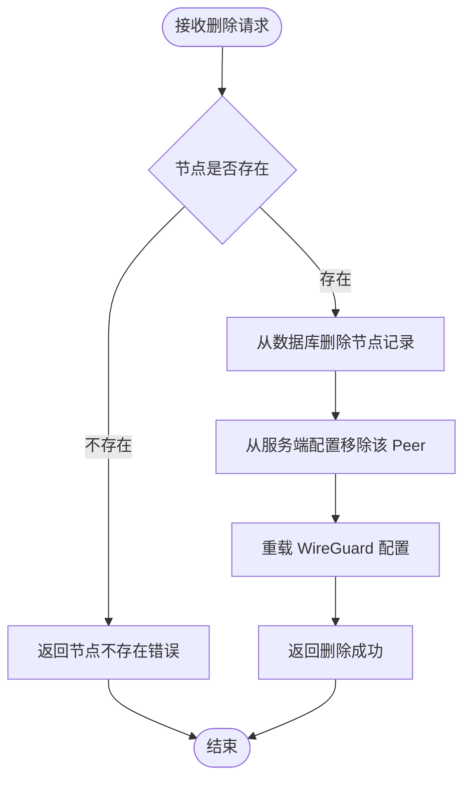

**注意事项**：
- 节点删除后，其占用的 IP 地址不立即回收
- 客户端侧的配置需手动清理
- 删除操作不可逆，需谨慎操作

#### 3.1.5 配置导出

**功能描述**：将客户端配置和脚本导出到本地文件系统，便于管理员手动分发。

**导出内容**：
- WireGuard 配置文件（.conf 格式）
- 平台对应的接入脚本
  - Linux：Shell 脚本（.sh）
  - Windows：PowerShell 脚本（.ps1）或批处理脚本（.bat）

**导出目录结构**：
```
输出目录/
├── node_name/
│   ├── wg0.conf              # WireGuard 配置文件
│   ├── install.sh            # Linux 接入脚本
│   └── install.ps1           # Windows 接入脚本（如适用）
```

### 3.2 HTTP API 服务

#### 3.2.1 API 设计原则

- 使用 RESTful 风格设计接口
- 采用 JSON 格式传输数据
- 暂不实现身份验证（仅内网或受信环境使用）
- 提供清晰的错误码和错误信息

#### 3.2.2 API 接口列表

| 接口路径 | 方法 | 功能 | 请求参数 |
|---------|------|------|---------|
| /api/nodes/register | POST | 注册新节点 | node_name, platform, description |
| /api/nodes/list | GET | 获取所有节点列表 | 无 |
| /api/nodes/{node_id} | GET | 获取指定节点详情 | node_id（路径参数） |
| /api/nodes/{node_id} | DELETE | 删除指定节点 | node_id（路径参数） |
| /api/download/config/{node_name} | GET | 下载节点配置文件 | node_name（路径参数） |
| /api/download/script/{node_name} | GET | 下载节点接入脚本 | node_name（路径参数） |

#### 3.2.3 响应格式

**成功响应**：
```
{
  "status": "success",
  "data": {具体数据内容}
}
```

**错误响应**：
```
{
  "status": "error",
  "error_code": "错误码",
  "message": "错误描述信息"
}
```

**常用错误码**：

| 错误码 | 说明 |
|-------|------|
| NODE_ALREADY_EXISTS | 节点名称已存在 |
| NODE_NOT_FOUND | 节点不存在 |
| INVALID_PARAMETER | 参数验证失败 |
| IP_POOL_EXHAUSTED | IP 地址池已耗尽 |
| INTERNAL_ERROR | 服务器内部错误 |

### 3.3 客户端接入

#### 3.3.1 接入方式

支持两种接入方式：

**方式一：在线下载接入**
- 客户端通过 HTTP API 下载配置文件和脚本
- 执行一条命令完成下载和安装

**方式二：离线分发接入**
- 管理员从服务端导出配置文件和脚本
- 手动分发给客户端
- 客户端执行脚本完成安装

#### 3.3.2 Linux 客户端接入流程

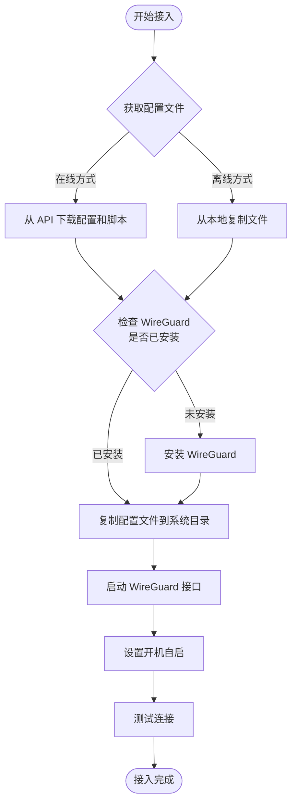

**脚本执行示例逻辑**：
- 检测 WireGuard 是否已安装，未安装则提示或尝试自动安装
- 将配置文件放置到系统配置目录
- 启动 WireGuard 接口
- 配置开机自启动
- 验证网络连通性

#### 3.3.3 Windows 客户端接入流程

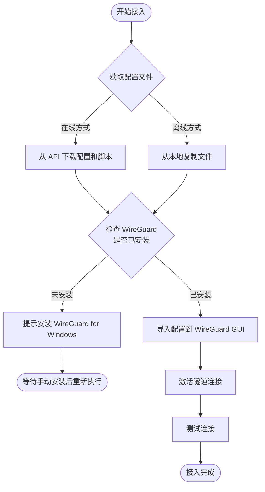

**脚本执行示例逻辑**：
- 检测 WireGuard for Windows 是否已安装
- 使用 WireGuard 命令行工具导入配置
- 激活隧道连接
- 验证网络连通性

#### 3.3.4 一键接入命令示例

**Linux 在线接入**：
```
客户端执行命令示例（自然语言描述）：
下载并执行接入脚本，参数包括服务端地址和节点名称
```

**Windows 在线接入**：
```
客户端执行命令示例（自然语言描述）：
使用 PowerShell 下载并执行接入脚本，参数包括服务端地址和节点名称
```

**离线接入**：
- 管理员提供配置文件和脚本压缩包
- 客户端解压后直接执行脚本

### 3.4 配置文件生成

#### 3.4.1 服务端配置结构

服务端 WireGuard 配置文件包含以下部分：

**Interface 部分**：
- 服务端私钥
- 服务端虚拟 IP 地址
- 监听端口
- 保存配置（可选）

**Peer 部分（每个客户端一个）**：
- 客户端公钥
- 允许的 IP 地址（客户端虚拟 IP）
- 持久连接保活（可选）

**配置更新策略**：
- 新节点注册时，在配置文件末尾追加新的 Peer 段
- 节点删除时，移除对应的 Peer 段
- 每次更新后重载 WireGuard 配置使其生效

#### 3.4.2 客户端配置结构

客户端 WireGuard 配置文件包含以下部分：

**Interface 部分**：
- 客户端私钥
- 客户端虚拟 IP 地址
- DNS 服务器（可选）

**Peer 部分（仅服务端）**：
- 服务端公钥
- 服务端公网地址和端口
- 允许的 IP 地址（路由规则，默认为虚拟网络段）
- 持久连接保活

**路由配置说明**：
- 默认仅路由虚拟网络段流量到 VPN
- 可选配置全局路由（所有流量经 VPN）
- 根据客户端需求动态生成

### 3.5 密钥管理

#### 3.5.1 密钥生成策略

- 服务端初始化时生成一对密钥（公钥、私钥）
- 每个客户端注册时生成独立的密钥对
- 使用 WireGuard 原生工具生成密钥，确保安全性
- 密钥采用 Base64 编码存储

#### 3.5.2 密钥存储

**服务端密钥**：
- 私钥：存储在数据库或配置文件中，严格限制访问权限
- 公钥：存储在数据库，可分发给客户端

**客户端密钥**：
- 私钥：存储在数据库中，仅在生成配置文件时使用
- 公钥：存储在数据库和服务端 WireGuard 配置中

#### 3.5.3 密钥安全

- 数据库文件设置严格的文件权限，仅服务端程序可访问
- 配置文件导出后提醒管理员妥善保管
- 客户端私钥仅在配置文件中分发，不通过其他渠道传输
- 暂不实现密钥轮换机制（未来扩展）

## 四、数据模型

### 4.1 数据库表结构

#### 4.1.1 server_info 表（服务端信息）

| 字段名 | 类型 | 约束 | 说明 |
|-------|------|------|------|
| id | INTEGER | PRIMARY KEY | 主键（仅一条记录） |
| public_key | TEXT | NOT NULL | 服务端公钥 |
| private_key | TEXT | NOT NULL | 服务端私钥 |
| virtual_ip | TEXT | NOT NULL | 服务端虚拟 IP（如 10.0.0.1） |
| listen_port | INTEGER | NOT NULL | WireGuard 监听端口 |
| network_cidr | TEXT | NOT NULL | 虚拟网络段（如 10.0.0.0/24） |
| created_at | TIMESTAMP | DEFAULT CURRENT_TIMESTAMP | 创建时间 |

#### 4.1.2 nodes 表（客户端节点信息）

| 字段名 | 类型 | 约束 | 说明 |
|-------|------|------|------|
| id | INTEGER | PRIMARY KEY AUTOINCREMENT | 节点 ID |
| node_name | TEXT | UNIQUE NOT NULL | 节点名称 |
| virtual_ip | TEXT | UNIQUE NOT NULL | 分配的虚拟 IP |
| public_key | TEXT | UNIQUE NOT NULL | 客户端公钥 |
| private_key | TEXT | NOT NULL | 客户端私钥 |
| platform | TEXT | NOT NULL | 平台类型（linux/windows） |
| description | TEXT | NULL | 节点描述 |
| created_at | TIMESTAMP | DEFAULT CURRENT_TIMESTAMP | 创建时间 |
| updated_at | TIMESTAMP | DEFAULT CURRENT_TIMESTAMP | 更新时间 |

#### 4.1.3 config_params 表（配置参数）

| 字段名 | 类型 | 约束 | 说明 |
|-------|------|------|------|
| key | TEXT | PRIMARY KEY | 参数键 |
| value | TEXT | NOT NULL | 参数值 |
| description | TEXT | NULL | 参数描述 |
| updated_at | TIMESTAMP | DEFAULT CURRENT_TIMESTAMP | 更新时间 |

**预置参数示例**：

| key | value | description |
|-----|-------|-------------|
| api_port | 8080 | HTTP API 服务端口 |
| persistent_keepalive | 25 | 持久连接保活间隔（秒） |
| dns_server | 8.8.8.8 | 默认 DNS 服务器 |
| export_dir | ./exports | 配置文件导出目录 |

### 4.2 数据关系

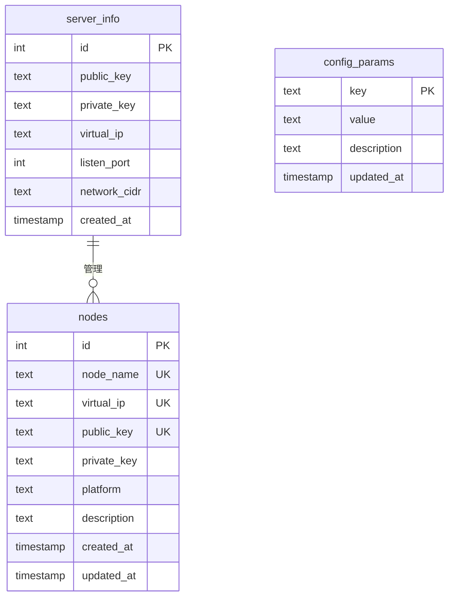

## 五、操作流程

### 5.1 服务端部署流程

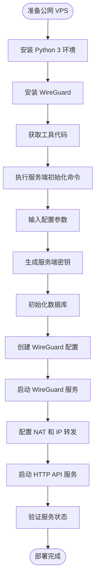

**关键步骤说明**：

1. **环境准备**：确保 VPS 具有公网 IP，开放 WireGuard 端口和 API 端口
2. **安装依赖**：安装 Python 3、WireGuard、必要的 Python 库
3. **初始化配置**：运行初始化脚本，输入监听端口、网络段等参数
4. **启动服务**：同时启动 WireGuard 服务和 HTTP API 服务
5. **防火墙配置**：确保 UDP 端口和 API 端口在防火墙中开放

### 5.2 客户端接入流程（在线方式）

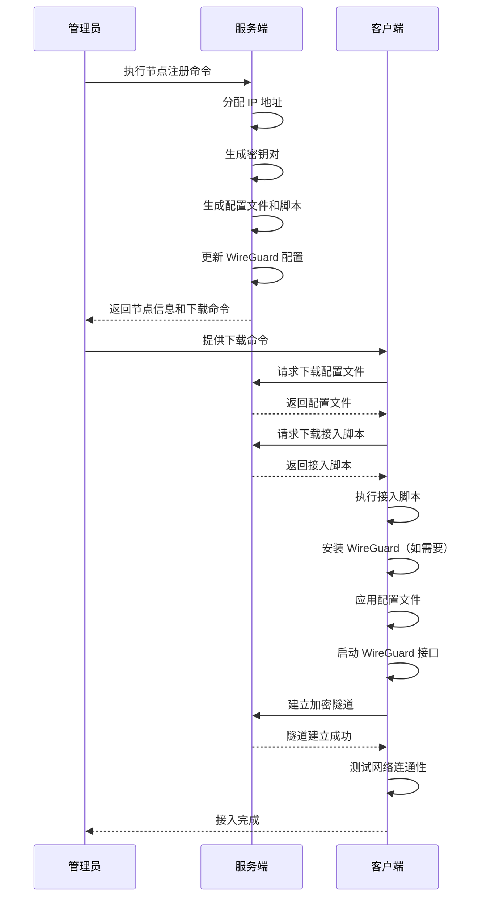

### 5.3 客户端接入流程（离线方式）

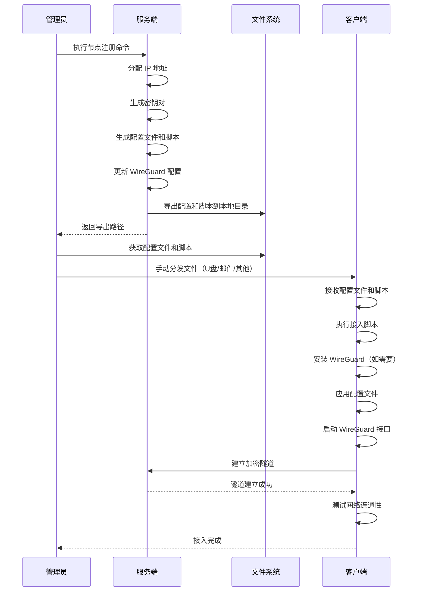

### 5.4 节点管理流程

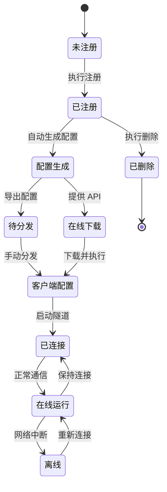

## 六、技术实现要点

### 6.1 WireGuard 配置管理

**配置文件操作原则**：
- 每次修改配置文件前备份
- 使用原子操作更新配置，避免并发冲突
- 配置更新后通过系统命令重载 WireGuard

**配置重载方式**：
- Linux：使用 wg syncconf 或 wg-quick down/up
- 确保重载过程不影响现有连接

**配置验证**：
- 生成配置文件后验证格式正确性
- 检查 IP 地址、密钥格式是否合法
- 确保端口号在有效范围内

### 6.2 IP 地址分配

**分配算法**：
- 从数据库查询当前最大的已分配 IP
- 将 IP 地址转换为整数，加 1 后转换回 IP 格式
- 检查新 IP 是否超出网络段范围
- 将新 IP 分配给客户端并记录到数据库

**边界处理**：
- 网络段第一个地址保留给服务端
- 网络段最后一个地址为广播地址，不分配
- IP 池耗尽时返回错误，拒绝新节点注册

**未来扩展**：
- 支持 IP 地址回收机制
- 支持客户端指定偏好 IP
- 支持多网段管理

### 6.3 密钥生成

**生成方式**：
- 调用 WireGuard 原生工具（wg genkey、wg pubkey）
- 私钥通过管道传递，避免写入临时文件
- 确保密钥生成过程的随机性和安全性

**密钥格式**：
- 私钥和公钥均为 Base64 编码字符串
- 长度固定为 44 字符（含填充）
- 存储时不需要额外编码

### 6.4 脚本生成

**Linux 脚本**：
- 使用 Bash 编写，兼容主流 Linux 发行版
- 检测系统包管理器（apt/yum/dnf）以适配安装命令
- 使用 wg-quick 管理 WireGuard 接口
- 包含错误处理和用户提示

**Windows 脚本**：
- 优先使用 PowerShell 编写，提供更好的功能支持
- 检测 WireGuard for Windows 安装路径
- 使用 wireguard.exe 命令行工具管理隧道
- 提供管理员权限检测和提示

**脚本通用功能**：
- 环境检测（WireGuard 是否已安装）
- 配置文件应用
- 服务启动和自启动设置
- 网络连通性测试（ping 服务端虚拟 IP）
- 详细的执行日志输出

### 6.5 HTTP API 实现

**技术选型**：
- 使用 Python 标准库或轻量级框架（如 Flask）
- 支持并发请求处理
- 提供静态文件下载功能

**安全考虑**：
- 暂不实现身份验证（仅内网或受信环境）
- 使用 HTTPS（未来扩展）
- 限制 API 访问来源（通过防火墙或配置）
- 防止路径遍历攻击（验证文件路径）

**错误处理**：
- 统一的异常捕获和错误响应
- 记录详细的错误日志便于排查
- 向客户端返回友好的错误信息

### 6.6 数据持久化

**SQLite 使用**：
- 单文件存储，便于备份和迁移
- 使用事务确保数据一致性
- 定期备份数据库文件

**并发控制**：
- SQLite 支持并发读，写操作串行化
- 使用 WAL 模式提高并发性能
- 避免长时间持有数据库锁

**数据迁移**：
- 预留版本号字段，支持未来数据库升级
- 提供数据导出和导入工具

## 七、部署和运维

### 7.1 服务端部署要求

**硬件要求**：
- CPU：1 核及以上
- 内存：512MB 及以上
- 存储：至少 1GB 可用空间
- 网络：具备公网 IP 地址，带宽根据节点数量和流量需求确定

**软件环境**：
- 操作系统：Linux（推荐 Ubuntu 20.04+ 或 CentOS 8+）
- Python：3.7 及以上版本
- WireGuard：最新稳定版本
- SQLite：3.x（通常随 Python 安装）

**网络要求**：
- 开放 WireGuard 监听端口（默认 51820/UDP）
- 开放 HTTP API 端口（默认 8080/TCP）
- 启用 IP 转发功能
- 配置 NAT 规则，允许客户端流量转发

### 7.2 客户端部署要求

**Linux 客户端**：
- 操作系统：主流 Linux 发行版（Ubuntu、CentOS、Debian 等）
- WireGuard：内核模块或用户态实现
- 具备 root 权限或 sudo 权限

**Windows 客户端**：
- 操作系统：Windows 10/11 或 Windows Server 2016+
- WireGuard for Windows：官方客户端
- 具备管理员权限

**网络要求**：
- 能够访问服务端公网 IP 和 API 端口
- 允许 UDP 流量出站

### 7.3 运维建议

**监控和日志**：
- 定期检查 WireGuard 服务状态
- 监控 HTTP API 服务运行情况
- 记录节点注册、删除等操作日志
- 监控虚拟网络流量和性能

**备份策略**：
- 定期备份 SQLite 数据库文件
- 备份服务端 WireGuard 配置文件
- 备份服务端密钥文件

**安全加固**：
- 限制 HTTP API 访问来源（仅允许管理员 IP）
- 定期更新 WireGuard 和系统补丁
- 设置严格的文件权限（数据库、配置文件、密钥文件）
- 考虑使用防火墙规则限制非法访问

**故障恢复**：
- 服务端故障：从备份恢复数据库和配置文件，重新启动服务
- 客户端故障：重新下载配置文件和脚本，重新执行接入流程
- 网络故障：检查防火墙规则、路由配置、WireGuard 服务状态

### 7.4 扩展性考虑

**未来可扩展功能**：
- Web 管理界面：提供图形化节点管理
- 身份验证：API 接口添加 Token 或用户认证
- ACL 控制：实现节点间访问控制策略
- 节点间直连：支持 P2P 模式，减轻服务端负载
- 流量统计：记录每个节点的流量使用情况
- 多服务端：支持多个服务端协同工作，实现高可用
- IP 偏好设置：允许用户指定虚拟 IP 地址

**性能优化方向**：
- 使用更高效的 Web 框架（如 FastAPI）
- 优化数据库查询和索引
- 实现配置缓存，减少文件 I/O
- 支持批量节点注册

## 八、风险和约束

### 8.1 技术风险

| 风险项 | 风险描述 | 缓解措施 |
|-------|---------|---------|
| WireGuard 兼容性 | 不同操作系统版本 WireGuard 实现差异 | 测试主流系统版本，提供兼容性说明 |
| IP 地址冲突 | 节点删除后 IP 复用可能导致冲突 | 暂不回收 IP，或实现回收冷却期 |
| 并发访问 | 多管理员同时操作可能导致数据不一致 | 使用数据库事务和锁机制 |
| 密钥泄露 | 配置文件包含私钥，分发过程可能泄露 | 提醒管理员使用安全通道分发，考虑加密传输 |

### 8.2 安全约束

| 约束项 | 说明 |
|-------|------|
| 无身份验证 | API 接口暂不实现身份验证，仅适用于受信环境 |
| 明文传输 | HTTP API 使用明文传输，敏感信息可能被窃听 |
| 无访问控制 | 所有节点可访问虚拟网络中的所有其他节点 |
| 密钥管理简单 | 不支持密钥轮换和撤销机制 |

### 8.3 功能约束

| 约束项 | 说明 |
|-------|------|
| 单服务端 | 仅支持单一服务端，不支持高可用部署 |
| 星型拓扑 | 所有流量必须经过服务端，可能成为性能瓶颈 |
| 无 NAT 穿透 | 客户端必须能直接访问服务端公网 IP |
| 有限的平台支持 | 仅支持 Linux 和 Windows，不支持 macOS、移动平台 |

### 8.4 运维约束

| 约束项 | 说明 |
|-------|------|
| 手动部署 | 服务端和客户端需要手动执行部署命令 |
| 有限监控 | 无内置监控告警功能，需依赖外部工具 |
| 简单日志 | 日志功能简单，不支持日志聚合和分析 |
| 无自动化运维 | 不支持节点自动发现、自动修复等高级功能 |

## 九、实施计划建议

### 9.1 开发阶段

**阶段一：核心功能开发**
- 服务端初始化逻辑
- 节点注册和 IP 分配
- 密钥生成和管理
- 配置文件生成

**阶段二：API 服务开发**
- HTTP API 接口实现
- 配置文件和脚本下载功能
- 节点查询和删除接口

**阶段三：客户端脚本开发**
- Linux 接入脚本
- Windows 接入脚本
- 脚本测试和兼容性验证

**阶段四：集成测试**
- 服务端和客户端端到端测试
- 多节点组网测试
- 网络连通性和性能测试

### 9.2 测试验证

**功能测试**：
- 服务端初始化和配置生成
- 节点注册、查询、删除
- 配置文件下载和脚本执行
- 客户端接入和网络通信

**兼容性测试**：
- 不同 Linux 发行版测试
- 不同 Windows 版本测试
- 不同 WireGuard 版本测试

**性能测试**：
- 大量节点注册性能
- 网络吞吐量和延迟测试
- API 并发请求测试

**安全测试**：
- 密钥生成随机性验证
- 配置文件权限检查
- API 接口安全性检查

### 9.3 文档编写

**用户文档**：
- 快速开始指南
- 服务端部署手册
- 客户端接入手册
- 常见问题解答

**管理员文档**：
- 服务端配置参数说明
- 节点管理操作指南
- 运维和故障排查
- 安全加固建议

**开发文档**：
- 架构设计文档
- API 接口文档
- 数据库设计文档
- 未来扩展规划

## 十、总结

本设计文档定义了一个基于 WireGuard 技术的快速组网工具，旨在简化 VPN 网络的部署和管理流程。系统采用星型拓扑结构，通过服务端集中管理客户端节点，实现自动化配置生成、密钥分发和一键接入。

**核心优势**：
- 降低技术门槛，简化部署流程
- 自动化程度高，减少人工操作
- 支持在线和离线两种接入方式
- 轻量级设计，易于部署和维护

**技术特点**：
- 使用 Python 实现服务端管理逻辑
- 基于 SQLite 实现轻量级数据持久化
- 提供 RESTful API 支持在线操作
- 支持 Linux 和 Windows 双平台客户端

**适用场景**：
- 小型团队内网组建
- 远程办公安全接入
- 多地分支机构互联
- 开发测试环境快速组网

**未来展望**：
在完成基础功能后，可根据实际需求逐步扩展 Web 界面、身份验证、访问控制、NAT 穿透等高级功能，进一步提升系统的易用性和安全性。

